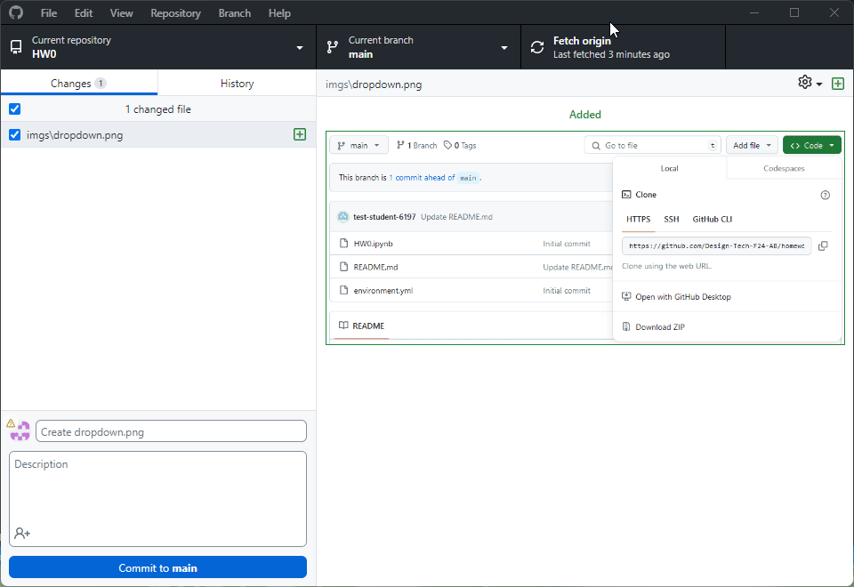

Welcome to the next step of homework 0! Congratulations on making it to this point. If you have never used github before, don't worry! I am going to give you some more step-by-step instructions on how to get started. 

Before you can begin actually working on the homework, you need to clone this repository to your local machine and set up your environment.

### Step 1: Clone the repository

Once you are in the repository, you should see a green button that says "Code". Click on that button and you should see a URL. Copy that URL using the copy button.

It should look like this:

Now go and open github desktop. Go to file -> clone repository. Make sure you are on the 'URL' tab and paste the URL you copied into the 'Repository URL' box. Choose a location on your computer where you want to save the repository and click 'Clone'. Generally you can just leave the path as it is, unless you have some specific reason to change it. 

Now you should see the repository in your github desktop. If you get a popup, you can just accept whichever option makes the most sense for you.

Finally you can click the button that says 'Open in Visual Studio Code' to open the repository in your code editor.

The process should look like this:

### Step 2: Set up your environment

Alright! You are closing in on the final step of setup! Now that you have the repository cloned to your local machine, you need to set up your environment.

In VS Code, open the terminal by going to Terminal -> New Terminal. You should see a terminal open at the bottom of your screen.

In the terminal, type the following command:

`mamba env create` 

and then press enter. This will create a new environment called 'DESIGN-6197-4197' install the necessary packages. These are all specified in the environment.yml file in the repository. I have created this file for you so you don't have to worry about installing the packages one by one.

Once the environment is done installing, you should see some instructions on how to activate the environment. You can ignore this and just close out of the terminal window.

### Step 3: Open the notebook

